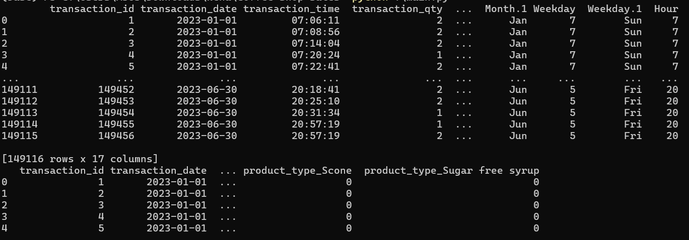
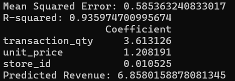

# Coffee Shop Sales Prediction

## Multi-Linear Regression Analysis

This repository contains a detailed implementation of a **Multi-Linear Regression Analysis** to predict coffee shop sales. The analysis aims to model the relationship between revenue and various transactional factors.

---

## Objective
Predict the revenue of coffee shop transactions using multiple independent variables such as transaction quantity, unit price, and store ID.

---

## Results

